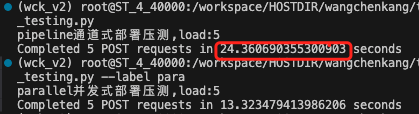

# llm_deploy
尝试async + uvicorn进行大模型的并行部署
- 通道
    - 非异步代码：pipeline_app_tornado.py
- 异步
    - 单卡异步: parallel_app_tornado.py 
    - 多卡：auto部署: parallel_app_tornado_v2.py
    - 多卡：模型单卡部署: parallel_app_tornado_v3_milt_models.py
- 压测
    - load_testing.py                        
    - 压测对比结果

- 模型下载
    - 脚本命令
    ```bash
    #下载模型
    bash hf_download/download_script.sh model gpt2

    #下载数据
    bash hf_download/download_script.sh dataset Shitao/MLDR